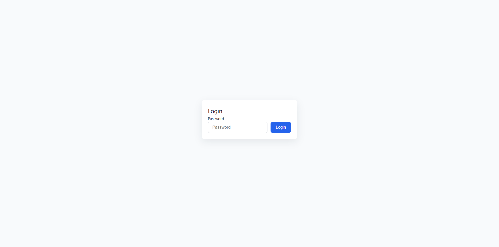
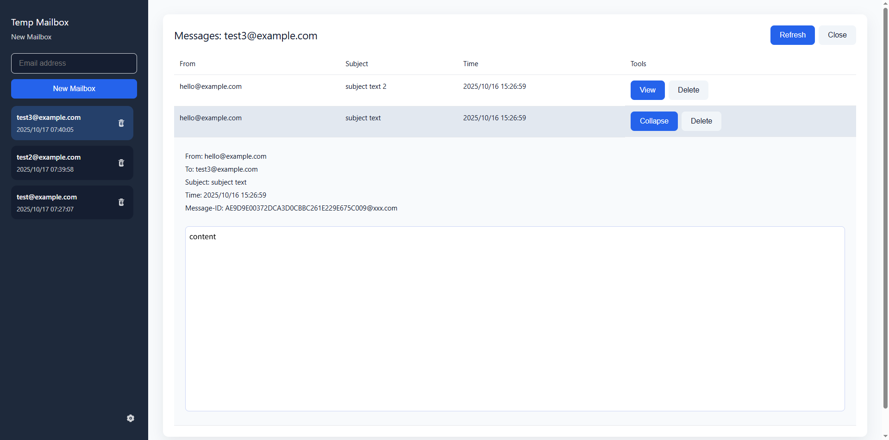

# Temp Mailbox

English | [简体中文](./README.zh-CN.md)

## About

`temp-mailbox` is a temporary email solution built with Cloudflare Workers and Vue.js. It allows you to create temporary email addresses and receive emails, protecting your privacy.

## Features

- **Temporary Email Generation**: Quickly generate a temporary email address.
- **Easy to Deploy**: Deploy on Cloudflare with a single command.

## Limitations

- **No Attachments**
- **Receive Only**

## Screenshots

**Login Page**


**Main Interface**


## Tech Stack

- Frontend: [Vue.js](https://vuejs.org/), [Vite](https://vitejs.dev/), [Vue I18n](https://vue-i18n.intlify.dev/)
- Backend: [Cloudflare Workers](https://workers.cloudflare.com/)
- Database: [Cloudflare D1](https://developers.cloudflare.com/d1/)

## Getting Started

### Prerequisites

- [Node.js](https://nodejs.org/) (version `^20.19.0 || >=22.12.0`)
- [pnpm](https://pnpm.io/) (or npm/yarn)
- A [Cloudflare](https://www.cloudflare.com/) account

### Installation and Local Development

1.  **Clone the repository:**
    ```bash
    git clone https://github.com/your-username/temp-mailbox.git
    cd temp-mailbox
    ```

2.  **Install dependencies:**
    ```bash
    npm install
    ```

3.  **Configure environment variables:**

    Create a `wrangler.toml` file by copying `wrangler.jsonc` and configure your Cloudflare account ID and other necessary variables. You'll also need to set up a D1 database and an email routing rule in your Cloudflare dashboard.

4.  **Run the development server:**
    ```bash
    npm run dev
    ```

### Deployment

Deploy the application to Cloudflare Workers:

```bash
npm run deploy
```
Modify the login Token in the worker settings-environment variables
Email routing, routing rules set Catch-All to send to Worker
