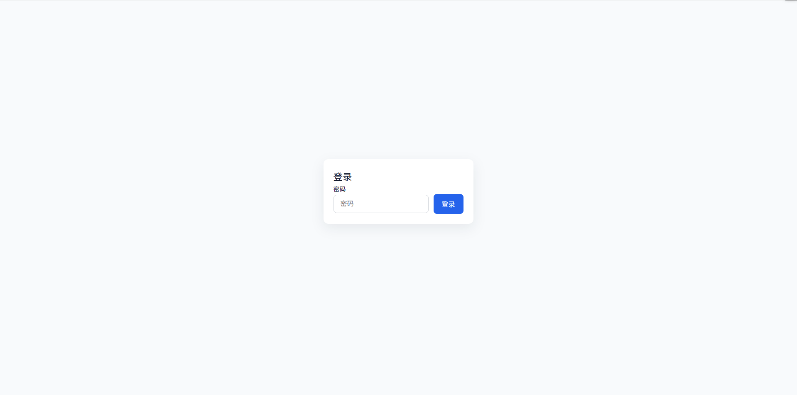
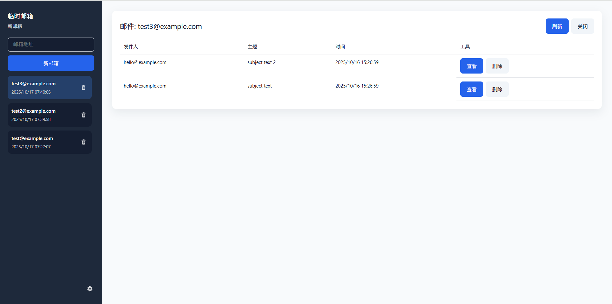

# Temp Mailbox (临时邮箱)

[English](./README.md) | 简体中文

## 关于

`temp-mailbox` 是一个基于 Cloudflare Workers 和 Vue.js 构建的临时邮箱解决方案。它允许您创建临时邮箱地址并接收邮件，从而保护您的隐私。

## 功能

- **生成临时邮箱**：快速生成一个临时邮箱地址。
- **易于部署**：一条命令即可部署到 Cloudflare。

## 限制

- **不支持附件**
- **不支持发件**

## 界面截图

**登录页面**


**主界面**


## 技术栈

- 前端: [Vue.js](https://vuejs.org/), [Vite](https://vitejs.dev/), [Vue I18n](https://vue-i18n.intlify.dev/)
- 后端: [Cloudflare Workers](https://workers.cloudflare.com/)
- 数据库: [Cloudflare D1](https://developers.cloudflare.com/d1/)

## 快速开始

### 环境要求

- [Node.js](https://nodejs.org/) (版本 `^20.19.0 || >=22.12.0`)
- [pnpm](https://pnpm.io/) (或 npm/yarn)
- 一个 [Cloudflare](https://www.cloudflare.com/) 账号

### 安装与本地开发

1.  **克隆仓库：**
    ```bash
    git clone https://github.com/your-username/temp-mailbox.git
    cd temp-mailbox
    ```

2.  **安装依赖：**
    ```bash
    npm install
    ```

3.  **配置环境变量：**

    通过复制 `wrangler.jsonc` 创建 `wrangler.toml` 文件，并配置您的 Cloudflare 账户 ID 及其他必要变量。您还需要在 Cloudflare 仪表板中设置 D1 数据库和电子邮件路由规则。

4.  **运行开发服务器：**
    ```bash
    npm run dev
    ```

### 部署

将应用部署到 Cloudflare Workers：

```bash
npm run deploy
```
在worker设置-环境变量里修改登录Token
电子邮件路由，路由规则设置Catch-All发送到 Worker
